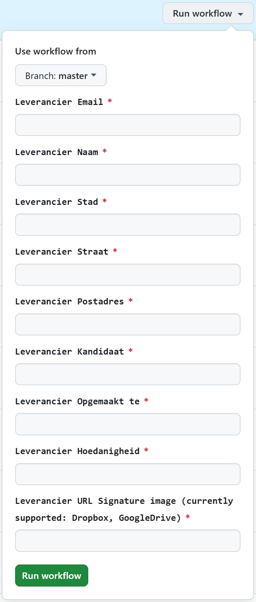
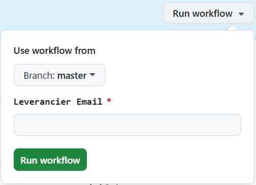
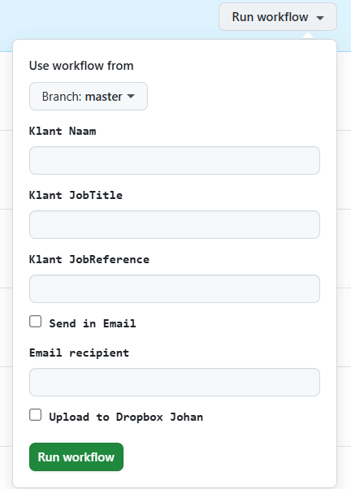

# MSWord Properties Generator

A tool for generating MSWord documents with properties from a database.

## Test Status


## Features

- Database integration for storing provider information
- PDF conversion capabilities
- Dropbox and Google Drive integration
- Encryption of sensitive data

## Installation

```bash
pip install -e .
```

## Usage

```python
from msword_properties_generator.data.utils_db import get_leverancier_dict

# Get provider data
provider_data = get_leverancier_dict(connection, "provider@example.com")
```

## Testing

Run the tests with:

```bash
pytest test/
```

For coverage report:

```bash
pytest --cov=msword_properties_generator test/
```

## License

MIT

# msword-properties-generator
This repo will facilitate in generating a documents pair (MSWord and .pdf). based on an MSWord template with some parameters to provide.<br> 
The user can provide a Dropbox or Google Drive link to a signature image to include in the document. 

2 types of information needed to insert in the template document;   
  - Provider information:
    - Filling out a GitHub Actions form.<br>
    That information will be encrypted and stored in this repo for you to later use again.<br>
  - Customer information in either two ways: 
    - MSExcel workbook containing the Customer Custom Properties ([OffersCustomer.xlsx](res%2FOffersCustomer.xlsx)).  
     Multiple Customers are possible. For each Customer an MSWord and pdf pair will be generated and send to the given mail address. 
    - Filling out a GitHub Actions form.<br>This will be the form that triggers the generation of the document pairs. (.docx and .pdf) 

At the moment of writing, depending of your choice, after the above actions this will result in:
- Sending a mail to the given e-mail address of the Provider with the generated documents. 
- Uploading the documents to the Dropbox of the owner of this repository.
- Customer data will not be stored. 
- Provider data *will* be stored in this Repo, encrypted to protect your privacy.

## Resources 
[offers_provider.db](res/offers_provider.db) All Providers are encrypted and stored in here with their hashed mail as key. \
[Recht om te vertegenwoordigen.docx](res/Recht%20om%20te%20vertegenwoordigen.docx) MSWord template containing the Custom properties.\
[OffersCustomer.xlsx](res/OffersCustomer.xlsx) Main xlsx to use as a vehicle to provide single or multiple Customer data to set into the .docx file above.\
[prod.properties](env/prod.properties) Properties for this logic to run containing all file names, folder locations.

## Future enhancements
- Update the xlsx to include the mail address as well.
- Some code cleanup 

## Usage
In order to have proper generated documents we need Provider and Customer data. Below how to do that.

### Provider data
Provider data doesn't change that much over time. Hence, since it's about quite some fields.<br>That data is stored in this repo.<br> 
How to provide and update?
- GitHub Actions > Select **"Subscribe or Update provider"** workflow > **"Run workflow"** to add or update yourself as a Provider to the [offers_provider.db](res/offers_provider.db).<br>
This process takes on average about 20 sec.
  - The last field you can provide an URL to Dropbox or Google Drive to a signature image.<br>Take into account a white background so it matches the background color of the document.
  <br><a href="assets/img_1.png"></a><br> 
  - In order for this to work, you'll need to share the image with permissions to **"Anyone that has the link"**.<br>
    Once this process is done, you can remove that permission of your link again.<br>
  - All your data will be encrypted. That includes the image that'll be stored in this repo under a hashed name to protect your privacy. 
- GitHub Actions > Select **"Unsubscribe provider"** workflow > **"Run workflow"** to remove your Provider data.<br>
This process takes on average about 20 sec.
  - All your Provider data will be removed, including the encrypted signature image file stored in the repo. 
  <br><a href="assets/img_2.png"></a><br>

### Customer data
Customer data changes frequently.<br>Every time you need documents to be generated these parameters are different, and are only a few fields.<br> 
How to provide? 2 options: 
- Update the [OffersCustomer.xlsx](res/OffersCustomer.xlsx) locally, Git commit & Push it back to this Repo. (Requires some Git knowledge) 
- GitHub Actions > Select **"Generate, Send and add to Dropbox"** workflow > **"Run workflow"**<br>to generate the documents and have them send to the given mail.<br>
This process takes on average about 2 min.
  - Behind the scenes [Provider data](#Provider data) will be picked up to consolidate in the generating of the document pair. (docx & pdf)<br>
  - So be aware that you'll need to have your Provider data in there as well for this to work.<br>Take into account Attention regarding the mail address.
  <br><a href="assets/img.png"></a>

## ⚠️Attention⚠️ 
- The way this 2-way information flow has been set up is by means of the mail address as key to relate both information.<br>
So the mail address provided for the Customer and Provider information screen must be equal.<br>
Check out the 3 screenshots in this article; they *must be the same* in order for this to work! 
  - "Leverancier Mail" 
