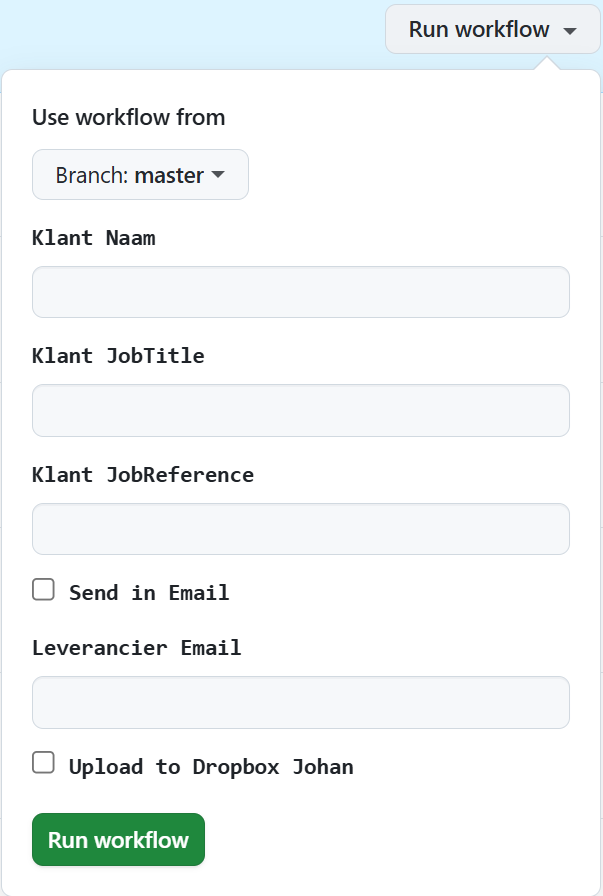

# msword-properties-generator

This repo will generate a MSWord document and update its Custom properties with and generate an accompanying .pdf.
- MSWord template document (containing Custom properties).  

Either 2 types of information   
  - Customer information in two ways: 
    -   MSExcel workbook containing the Custom Properties ([OffersCustomer.xlsx](res%2FOffersCustomer.xlsx)).  
     Take the xlsx, Git commit & push to GitHub.   
    The [generate-send-email.yml](.github/workflows/generate-send-email.yml) workflow will do the rest for you. You can add multiple Customers in that xlsx.
    - Providing customer information can also be done by means of a manual trigger of [generate-send-email.yml](.github/workflows/generate-send-email.yml) workflow in GitHub Actions.

  - Provider information:  
    - Providing information can be done by means of a manual trigger of the [update-provider.yml](.github/workflows/update-provider.yml) workflow. 
    That information will be encrypted and stored in a SQLite db and committed in this repo. 
    The key to the right Provider information will be its mail address. (encrypted as well)

At the moment of writing, depending of your choice, the above actions will result in:
- Sending a mail to the provided mail of the provider with the generated documents 
- Uploading the documents to the Dropbox of the owner of this repository.

## Resources 
[JohanSign.jpg](res/images/JohanSign.jpg) Signature image to replace in the MSWord document.
[offers_provider.db](res/offers_provider.db) All providers are stored and encrypted in here with their mail as key to retrieved. 
[Recht om te vertegenwoordigen.docx](res/Recht%20om%20te%20vertegenwoordigen.docx) MSWord template containing the Custom properties.\
[OffersCustomer.xlsx](res/OffersCustomer.xlsx) Main xlsx that contains the Custom properties to set into the .docx file.\
[prod.properties](env/prod.properties) Properties for this logic to run containing all file names, folder locations.

## Future enhancements
- Providing an (encrypted) image to replace for each provider. This will have to be done manually by adding & committing it to GitHub.
- Small cosmetic bugs need to be fixed
- Some code cleanup 

## Usage  
- Commit & Push a changed OffersCustomers.xlsx.
- GitHub Actions  
  - Providing 1 customer information: Select "Generate, Send and add to Dropbox" workflow > "Run workflow" to generate the documents and have them send to you. 
  - Providing provider information: Select "Subscribe provide" workflow > "Run workflow"  to add yourself to the offers_provider.db. The content won't be readable to assure privacy. 
   

